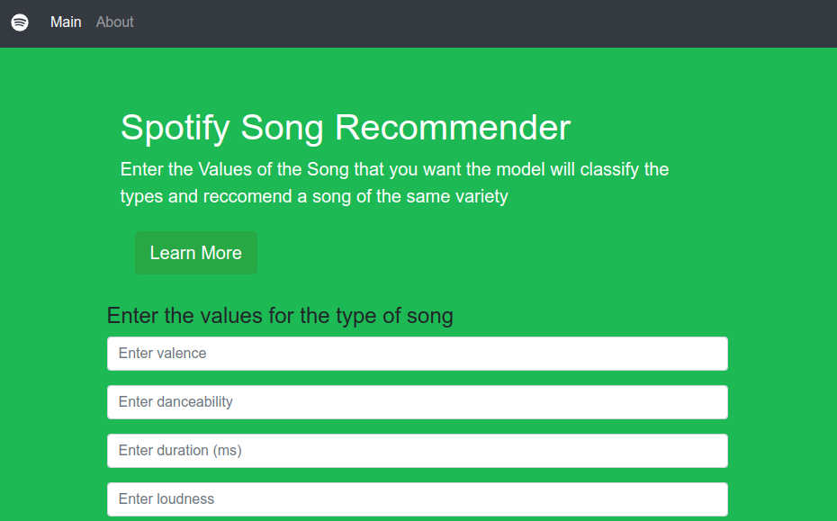

# Music Analysis and Recommendations Web App



This repository contains the code for a Flask web application that provides music analysis and recommendations based on machine learning algorithms. The app allows users to explore the emotional and musical characteristics of songs, analyze various audio features, and discover new tracks based on their preferences.

## Features

- Analyze song characteristics such as valence, danceability, duration, loudness, and more.
- Get personalized music recommendations based on your preferences.
- User-friendly interface with an intuitive and interactive design.
- Powered by machine learning algorithms for accurate analysis and recommendations.

## Installation

1. Clone the repository:

   ```console
   git clonehttps://github.com/KeeganFernandesWork/song_reccomender
```
2. 
